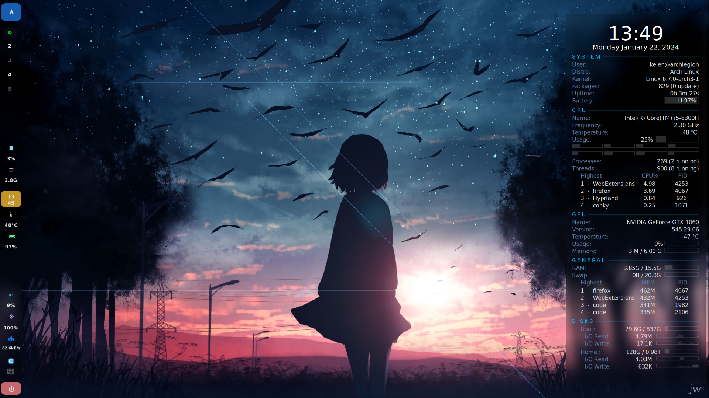
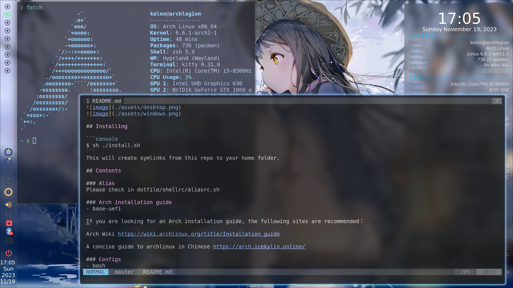

# kelen's dotfiles

**Warning**: Don’t blindly use my settings unless you know what that entails. Use at your own risk!

I'm working with Arch Linux and Debian.

## Styles  
**"Keep it simple stupid."**



## Installing

```console
$ sh ./install.sh
```
This will create symlinks from this repo to your home folder.

## Contents

### Alias
Please check in [dotfile/shellrc/alias.sh](./shellrc/alias.sh).

### Arch installation guide
- base-uefi

If you are looking for an Arch installation guide, the following sites are recommended：

Arch Wiki https://wiki.archlinux.org/title/Installation_guide

A concise guide to archlinux in Chinese https://arch.icekylin.online/

### Configs
- bash
- btop
- conky
- dust
- eww
- fastfetch
- fcitx5 with rime-ice
- gBar
- kitty
- mpd
- nnn
- paru
- picom
- pip
- powerlevel10k
- rofi
- swaylock-effects
- thefuck
- vim
- wallpaper engine on linux
- waybar
- wofi
- zsh, working with autojump, autosuggestions, command-not-found, completions, history-substring-search and syntax-highlighting

### PKGBUILDs
Research packages that are maintained by me or archived for geophysics.
- cuda-multiversion
- intel-oneapi-hpckit (include oneapi-basekit)
- madagascar
- mathematica
- matlab
- miniconda3
- plplot
- seismic-unix
A geophysics-related code list that is not packaged can be found [here](./pkgbuilds/README.md).


### Scripts
- background-changer
- check kernel: reboot required or not
- gitclean
- killprocess
- linux-wallpaperengine
- logout
- maintenace
- pytorch cuda test
- screenshot
- volume control
- wayland session lock

### Wallpapers
Please check in [dotfile/wallpaper](./wallpaper/).

### Window manager
- Awesomewm
- dwm
- Hyprland

## License
The code is available under the [MIT license][license].

---
**Dotfile** ©kelen. Released under the MIT License.

Authored and maintained by kelen.

<!-- Link labels: -->
[license]: LICENSE