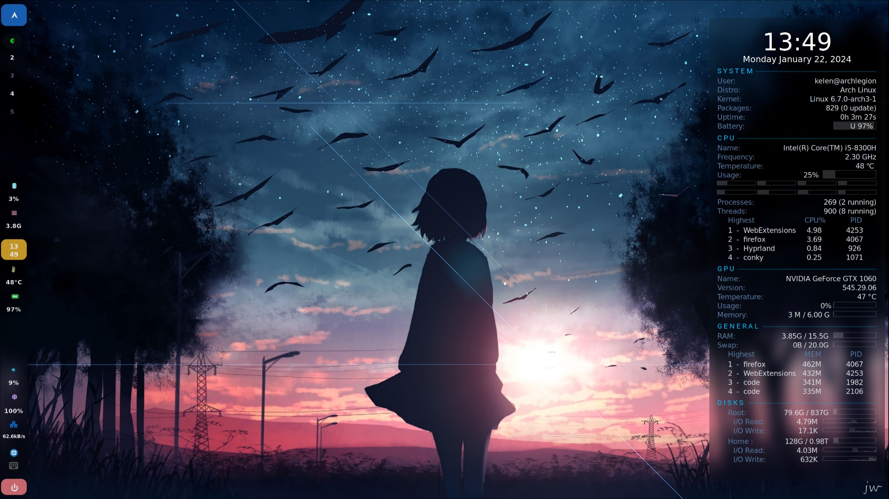
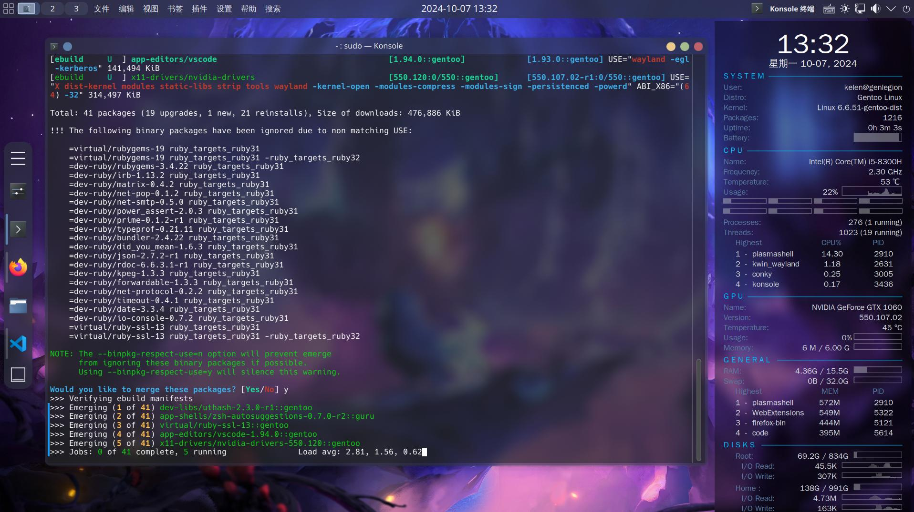

# kelen's dotfiles

**This repository is designed to sync and restore my working environment, including: setting up bash/zsh with required environment variables, linking tool configs, restoring the window manager with backup options, and managing additional resources such as package management backups, symbol fonts, and wallpapers. I follow XDG standards for linking and provide an install script. Your existing dotfiles are backed up in a 'bak' folder for safety.**

---

## Styles  
**"Keep it simple stupid."**




> ri • cing 
> /ry-sing/
>
> 1. Making visual improvements and customization to your desktop and/or phone that can simplify your desktop environment but (generally) are completely pointless.
> 2. Wasting time because aesthetic.


## How to use
***Warning***: A word of caution, I am actively working with **Arch Linux**, **Debian** and **Gentoo**. Do not blindly use my settings unless you know what that entails. Use at your own risk!

Run this to install:
```
git clone https://github.com/yingchangliu/dotfiles.git --recurse-submodules --depth=1
cd ~/dotfiles
./install
```
***Note***: You may need to modify  [`shellrc/zshplugin.zsh`](./shellrc/zshplugin.zsh) to fit your distribution. Package managers put their plugins in different directories.

Typing uninstall will restore your original settings.
```
sh ./install uninstall
```
## Contents

### Alias
- wttr: weather
- l/ll/la/l./lt etc.: ls commands
- cp/mv/rm: Safety features
- git: git commands
- ex/cx: extract compressed files
- package manager commands (pacman, apt, dnf, zypper, emerge)
    - install
    - remove
    - update
    - upgrade
    - reinstall
    - cleanup
    - search
    - provider
- etc. 
Please check in [shellrc/alias.sh](./shellrc/alias.sh) and [shellrc/functions.sh](./shellrc/functions.sh).

### Bin
- ap/rp: path converter (from https://github.com/oldratlee/useful-scripts)
- archive: archive files
- c: Run command and put output to system clipper (from https://github.com/oldratlee/useful-scripts)
- checkboot: reboot required or not
- dec2hex/hex2dec/dec2bin/bin2dec: number converter
- extract: extract compressed files
- installdots: dotfiles installer
- gitreset/gitshrink/gitpurge: git commands scripts
- portagebackup: portage sync
- etc.


### Configs
- bash
- btop
- conky
- dust
- fastfetch
- gBar
- kitty
- mako
- mpd
- nnn
- pacman
- paru
- picom
- pip
- rofi
- scripts
    - background-changer
    - idle lock
    - killprocess
    - screenrecord
    - screenshot
    - volume control
    - wallpaper changer
    - weather
- swaylock-effects
- thefuck
- vim
- wallpaper engine on linux
- waybar
- wofi
- zsh, working with autocomplete, autojump, autosuggestions, command-not-found, completions, history-substring-search, powerlevel-10k and syntax-highlighting

### Extra
External backups about package manager.
- HPC test codes.
- My packages (pacman and portage) backup.
- Pkgbuilds (Arch linux) for programming. 
- Zshplugins which are not in Debian official repo.

### Fonts


### Wallpapers
Please check in [wallpapers](./wallpapers/).

### Window manager
- dwm (Xorg)
- KDE Plasma (DE on workstation)
- Hyprland (Wayland)
- Deprecated WMs, for which their configurations are no longer maintained.
    - awesome
    - bspwm
    - river
    - sway
    - xfce4


## License
The code is available under the [MIT license][license].

---
**Dotfiles** © [kelen](https://github.com/YingchangLiu/). Released under the MIT License.

Authored and maintained by kelen. Additionally, I have learned and stolen a lot from the community.

<!-- Link labels: -->
[license]: LICENSE
