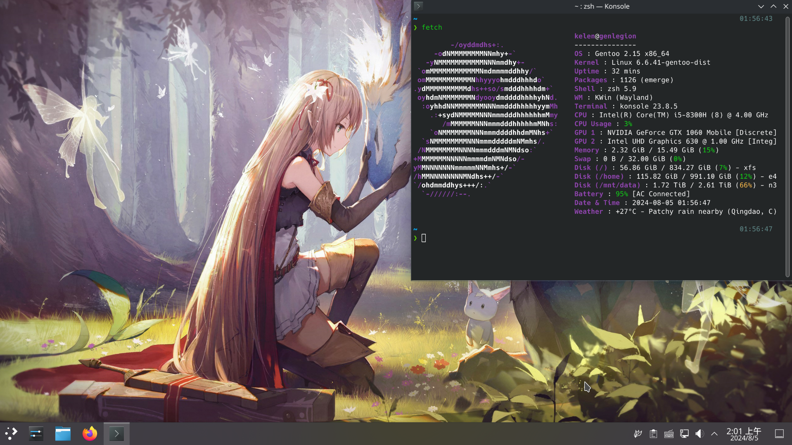

# kelen's dotfiles

***Warning***: I'm working with **Arch Linux**, **Debian** and **Gentoo**. Do not blindly use my settings unless you know what that entails. Use at your own risk!

---

## How to use
This will create symlinks from this repo to your home folder.
```console
$ sh ./install
```
Typing uninstall will restore your original settings.
```
$ sh ./install uninstall
```

## Styles  
**"Keep it simple stupid."**




> ri • cing 
> /ry-sing/
>
> 1. Making visual improvements and customization to your desktop and/or phone that can simplify your desktop environment but (generally) are completely pointless.
> 2. Wasting time because aesthetic.


## Contents

### Alias
- wttr: weather
- l/ll/la/l./lt etc.: ls commands
- cp/mv/rm: Safety features
- git: git commands
- ex/cx: extract compressed files
- package manager commands (pacman, apt, dnf, zypper, emerge)
    - install
    - remove
    - update
    - upgrade
    - reinstall
    - cleanup
    - search
    - provider
- etc. 
Please check in [shellrc/alias.sh](./shellrc/alias.sh) and [shellrc/functions.sh](./shellrc/functions.sh).

### Bin
- ap/rp: path converter (from https://github.com/oldratlee/useful-scripts)
- archive: archive files
- c: Run command and put output to system clipper (from https://github.com/oldratlee/useful-scripts)
- checkboot: reboot required or not
- dec2hex/hex2dec/dec2bin/bin2dec: number converter
- extract: extract compressed files
- installdots: dotfile installer
- gitreset/gitshrink/gitpurge: git commands scripts
- portagebackup: portage sync
- etc.


### Configs
- bash
- btop
- conky
- dust
- fastfetch
- fcitx5 with rime-ice
- gBar
- kitty
- mpd
- nnn
- paru
- picom
- pip
- powerlevel10k
- rofi
- scripts
    - background-changer
    - idle lock
    - killprocess
    - screenrecord
    - screenshot
    - volume control
    - wallpaper changer
    - weather
- swaylock-effects
- thefuck
- vim
- wallpaper engine on linux
- waybar
- wofi
- zsh, working with autocomplete, autojump, autosuggestions, command-not-found, completions, history-substring-search, powerlevel-10k and syntax-highlighting

### Extra
External backups about package manager.
- HPC test codes.
- My packages backup.
- Pkgbuilds (Arch linux) for programming. 

### Fonts, icons


### Wallpapers
Please check in [wallpaper](./wallpaper/).

### Window manager
- dwm (Xorg)
- KDE Plasma (DE on workstation)
- Hyprland (Wayland)


## License
The code is available under the [MIT license][license].

---
**Dotfile** ©kelen. Released under the MIT License.

Authored and maintained by kelen. Additionally, I have learned and borrowed a lot from the community.

<!-- Link labels: -->
[license]: LICENSE
